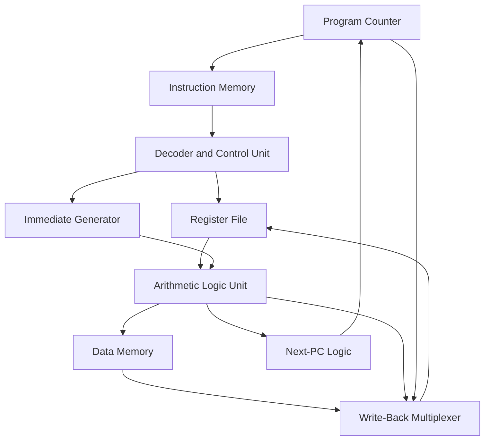

# RV32I Single-Cycle RISC-V Processor


A modular 32-bit **single-cycle RISC-V processor**, designed and tested in SystemVerilog over seven weeks. The project demonstrates the complete instruction path—from instruction fetch and decoding to execution, memory access, and register write-back. It also provides a foundation for future research in **edge machine learning, TinyML, and hardware–software co-design**.

# Project Overview

This project implements a practical subset of the **RV32I base integer instruction set architecture**. Each instruction completes within a single clock cycle, making the processor suitable for learning, simulation, testing, and future architectural improvements.

The main objectives of this project were to:

* Understand RISC-V instruction formats and execution.
* Design reusable RTL modules for a complete processor.
* Implement arithmetic, logical, memory, branch, and jump instructions.
* Integrate the processor’s datapath and control unit.
* Test individual components and the complete processor through simulation.
* Develop a processor that can later be extended for machine-learning applications.

## Key Features

* 32-bit RISC-V architecture
* Single-cycle instruction execution
* Modular SystemVerilog implementation
* 32 × 32-bit register file
* Register `x0` permanently fixed at zero
* Immediate generation for I-, S-, B-, U-, and J-type instructions
* Arithmetic, logical, comparison, and shift operations
* Byte-addressable data memory
* Conditional branch support
* Jump and link support
* ALU, memory, and `PC + 4` write-back options
* Directed module-level testing
* Integrated processor simulation using Questa/ModelSim

## Processor Architecture



The processor follows the basic instruction-execution sequence:

1. The program counter provides the address of the instruction.
2. Instruction memory returns the corresponding 32-bit instruction.
3. The control unit decodes the opcode, `funct3`, and `funct7` fields.
4. The register file provides the required source operands.
5. The immediate generator produces the required immediate value.
6. The ALU performs the selected operation.
7. Data memory is accessed when required.
8. The appropriate result is written back to the destination register.
9. The next-PC logic selects `PC + 4`, a branch target, or a jump target.

## Control Signals

The controller generates signals that coordinate the complete datapath.

| Control Signal | Purpose                                           |
| -------------- | ------------------------------------------------- |
| `ALUOP`        | Selects the required ALU operation                |
| `RegWEn`       | Enables writing to the register file              |
| `a_sel`        | Selects the first ALU input                       |
| `b_sel`        | Selects the second ALU input                      |
| `Mem_RW`       | Controls data-memory read/write behavior          |
| `wb_sel`       | Selects the register write-back source            |
| `pc_sel`       | Selects the next program-counter value            |
| `branch_taken` | Indicates whether a branch condition is satisfied |

## Supported Instruction Classes

| Format | Implemented Functionality                              |
| ------ | ------------------------------------------------------ |
| R-type | Register-to-register arithmetic and logical operations |
| I-type | Immediate arithmetic and load-address generation       |
| S-type | Byte, half-word, and word store operations             |
| B-type | Conditional branch instructions                        |
| U-type | Upper-immediate generation                             |
| J-type | Jump and link operation                                |

### R-Type Operations

The ALU supports several register-to-register operations, including:

* `ADD`
* `SUB`
* `SLL`
* `SLT`
* `SLTU`
* `XOR`
* `SRL`
* `SRA`
* `OR`

### Store Instructions

The data-memory system supports:

* `SB` — Store Byte
* `SH` — Store Half-word
* `SW` — Store Word

### Branch Instructions

The branch-control system supports:

* `BEQ` — Branch if Equal
* `BNE` — Branch if Not Equal
* `BLT` — Branch if Less Than
* `BGE` — Branch if Greater Than or Equal

### Jump Instruction

The processor supports the `JAL` instruction.

For `JAL`:

* The program counter jumps to `PC + immediate`.
* The return address `PC + 4` is written to the destination register.

For example:

```text
jal x1, +8
```

When this instruction is executed at address `0`:

```text
New PC = 8
x1 = 4
```

# Main RTL Modules

| Module                 | Responsibility                                                          |
| ---------------------- | ----------------------------------------------------------------------- |
| Program Counter        | Stores the address of the current instruction                           |
| Instruction Memory     | Stores 256 × 32-bit program instructions                                |
| Controller             | Decodes instructions and generates control signals                      |
| Immediate Generator    | Generates I-, S-, B-, U-, and J-type immediate values                   |
| Register File          | Provides two source operands and stores the write-back result           |
| ALU                    | Performs arithmetic, logical, shift, comparison, and address operations |
| Data Memory            | Provides 1 KiB of byte-addressable storage                              |
| Branch Logic           | Evaluates branch conditions                                             |
| Next-PC Logic          | Selects the next instruction address                                    |
| Write-Back Multiplexer | Selects ALU, memory, or `PC + 4` data                                   |

## Memory Organization

### Instruction Memory

The instruction memory contains:

```text
256 × 32-bit instructions
```

Because each instruction is four bytes, the processor uses word-aligned addressing. Address bits `[9:2]` can be used to select the required instruction word.

### Data Memory

The data memory contains:

```text
1 KiB of byte-addressable memory
```

The memory supports byte, half-word, and word-level operations. The `funct3` field determines the size of the memory operation.

## Seven-Week Development Timeline

| Week   | Development Milestone                                                                            |
| ------ | ------------------------------------------------------------------------------------------------ |
| Week 1 | Studied RV32I instruction encoding and designed the program counter and instruction-fetch path   |
| Week 2 | Designed and tested the ALU and R-type datapath                                                  |
| Week 3 | Added the register file, immediate generator, and I-type execution                               |
| Week 4 | Implemented byte-addressable data memory and load/store behavior                                 |
| Week 5 | Added conditional branch comparison and next-PC selection                                        |
| Week 6 | Implemented jump and upper-immediate paths, including `JAL`                                      |
| Week 7 | Integrated the complete processor, debugged module connections, and completed simulation testing |

## Verification and Testing

The processor was tested in **Questa/ModelSim** using SystemVerilog testbenches. Both individual components and the complete datapath were tested.

Testing covered:

* Program-counter reset
* Sequential `PC + 4` operation
* Register-file read and write operations
* Protection of register `x0`
* Arithmetic and logical ALU operations
* Signed and unsigned comparisons
* Logical and arithmetic shifts
* Immediate generation and sign extension
* Byte, half-word, and word memory operations
* Branch-taken conditions
* Branch-not-taken conditions
* Jump target calculation
* ALU-result write-back
* Memory-data write-back
* `PC + 4` write-back for `JAL`

Simulation waveforms were used to observe:

* Current program-counter value
* Instruction
* Opcode
* Source and destination registers
* Register operands
* Immediate value
* ALU operation
* ALU result
* Memory controls
* Branch decision
* Next program-counter value
* Register write-back data

## Running the Simulation

A typical Questa/ModelSim simulation can be started using:

```bash
vlib work
vlog -sv rtl/*.sv tb/*.sv
vsim -c work.tb_single_cycle_riscv -do "run -all; quit"
```

For graphical waveform inspection:

```bash
vsim work.tb_single_cycle_riscv
add wave -r /*
run -all
```

The top-level processor and testbench names should be changed if different names are used in the repository.

Instruction-memory initialization files should contain one 32-bit machine instruction per word in the format expected by the testbench.

## Connection to Machine Learning

The current processor is a general-purpose RISC-V processor rather than a complete machine-learning accelerator. However, it provides an important foundation for future machine-learning hardware development.

A RISC-V processor can manage:

* Program control
* Sensor-data collection
* Data preprocessing
* Memory access
* Activation functions
* ML accelerator configuration
* Output classification
* Communication with external devices

A future machine-learning system could combine this RISC-V processor with a dedicated accelerator:

```text
RISC-V Processor
        |
        | Memory-Mapped Interface
        |
Machine-Learning Accelerator
        |
        | Matrix Multiplication / Convolution
        |
Inference Result
```

Possible ML-related extensions include:

* Adding multiply-accumulate instructions
* Designing a hardware MAC unit
* Supporting quantized 8-bit and 16-bit data
* Adding SIMD operations
* Connecting a matrix-multiplication accelerator
* Implementing a convolution accelerator
* Running small TinyML inference models
* Comparing software and hardware inference performance
* Measuring execution cycles, power consumption, and memory traffic
* Developing custom RISC-V instructions for neural networks

For example, neural-network calculations frequently use the following operation:

```text
Result = Result + Weight × Input
```

A dedicated multiply-accumulate unit could perform this operation more efficiently than separate software instructions.

The RISC-V processor could control the overall program while the hardware accelerator performs intensive matrix or convolution calculations. This approach is commonly used in **edge AI systems**, where efficient local processing is required.

## Design Limitations

* Every instruction completes in one clock cycle.
* The longest combinational path determines the processor’s clock period.
* Instruction and data memories are separated.
* The processor does not currently contain a pipeline.
* There is no forwarding or hazard-detection unit.
* Cache memory is not included.
* Interrupt and exception handling are not included.
* Multiplication and division instructions are not included.
* Floating-point instructions are not supported.
* Performance, area, and power results require FPGA or ASIC synthesis.

## Future Work

Future improvements may include:

1. Completing and verifying additional RV32I instructions.
2. Creating automated self-checking testbenches.
3. Adding instruction-coverage reporting.
4. Synthesizing the design for an FPGA.
5. Measuring timing, area, and power consumption.
6. Converting the design into a five-stage pipelined processor.
7. Adding hazard detection and forwarding.
8. Adding cache memory.
9. Implementing interrupt and exception handling.
10. Adding performance counters.
11. Designing a multiply-accumulate unit.
12. Adding custom instructions for machine-learning operations.
13. Integrating a quantized neural-network accelerator.
14. Running a small image-classification or sensor-classification model.

## Skills Demonstrated

* RISC-V architecture
* SystemVerilog
* RTL design
* Digital logic design
* Computer architecture
* ALU design
* Register-file design
* Memory interfacing
* Control-unit design
* Instruction decoding
* Functional verification
* Questa/ModelSim simulation
* Waveform analysis
* Hardware–software co-design
* Machine-learning hardware concepts

## Conclusion

This project demonstrates the successful design, integration, and simulation of a 32-bit single-cycle RISC-V processor within seven weeks. It provides practical experience in instruction decoding, datapath design, control-signal generation, memory operations, branch handling, and functional verification.

The completed processor also provides a strong foundation for more advanced work in pipelined architectures, FPGA implementation, custom RISC-V instructions, TinyML, and edge machine-learning acceleration.
